<p align="center">
  
</p>

<h1 align="center">Liquid Light</h1>

<p align="center"><em>A cinematic, citation-grade simulator of polariton superfluidity, the room-temperature breakthrough, and the analog black hole horizon. Built on the Amo (2009) / Lerario (2017) / Falque (2025) experimental chain.</em></p>

<p align="center">
  <strong>Designed and directed by Dr. Mohamed El-Hadedy</strong><br>
  <em>Director, Reconfigurable Space Computing Lab</em><br>
  California State Polytechnic University, Pomona
</p>

<p align="center">
  <a href="https://mealycpp.github.io/liquid-light/"><strong>→ Open the live simulator</strong></a>
</p>

---

## What it is

A six-chapter web simulator that lets a non-expert *feel* what happens when light is trapped between two mirrors at low temperature and starts to behave as a quantum fluid. No physics background required. The visitor is guided forward by a single button, one chapter at a time, while a guide narrates what they're seeing.

The chapters in order:

1. **Before we begin** — empty space. The viewer is invited in.
2. **Ordinary light** — yellow rays cast shadows behind obstacles. The world they grew up in.
3. **The cavity closes** — two mirrors close at 5 K. Photons pair with electrons to form polaritons.
4. **Liquid light flows** — the climactic scene. The condensate parts around a stone and rejoins without a wake. *No shadow.*
5. **The horizon forms** — past the critical velocity, vortices appear and an analog black hole horizon forms behind the obstacle.
6. **What is it made of?** — a materials catalog. Four cards: classic GaAs, organic semiconductor, halide perovskite, ultracold rubidium. Each card retints the scene to that material's signature.

## Why we built it

Most physics visualizations either oversimplify into a cartoon or overwhelm with equations. The space in between — where a high-school student feels the *wow* and a graduate student trusts the *physics* — is where good science communication lives. Liquid Light is our attempt at that space, for one of the most beautiful experimental results of the past two decades.

## The science

Every effect in the simulator dramatizes a published experiment. We built the simulator; physicists built the cavities. The citation chain is verified across ten rounds of audit (May 2026):

- **Hawking 1974, Unruh 1981** — the theoretical seeds for analog gravity
- **Kasprzak et al., Nature 443, 409 (2006)** — first polariton Bose-Einstein condensate
- **Amo et al., Nature Physics 5, 805 (2009)** — first observation of polariton superfluidity, the foundational paper
- **Sanvitto et al., Nature Photonics 5, 610 (2011)** — all-optical control of polariton flow with a shaped light beam
- **Nguyen et al., Physical Review Letters 114, 036402 (2015)** — first experimental polariton acoustic black hole
- **Lerario et al., Nature Physics 13, 837 (2017)** — room-temperature polariton superfluidity in organic semiconductors
- **Muñoz de Nova et al., Nature 569, 688 (2019)** — Hawking temperature measured in the BEC analog
- **Su et al., Nature Communications 13, 7437 (2022)** — room-temperature polariton fluids in halide perovskites
- **Falque et al., Physical Review Letters 135, 023401 (2025)** — programmable curved spacetimes in polariton fluids, the cutting edge

The complete, verified reference document with author lists, DOIs, and audit notes lives in [`docs/REFERENCES.md`](docs/REFERENCES.md).

## How to view it

**Online (easiest):** Open [mealycpp.github.io/liquid-light/](https://mealycpp.github.io/liquid-light/) in any modern browser.

**Locally:** clone this repo and open `index.html` directly in your browser. No build step, no dependencies, no install. Just open the file.

```bash
git clone https://github.com/mealycpp/liquid-light.git
cd liquid-light
open index.html   # macOS
xdg-open index.html   # Linux
start index.html   # Windows
```

## How to navigate the simulator

- **Click the big button** (begin / continue / restart) to move through chapters
- **Click anywhere in the scene** to drop a stone in the fluid (chapters 2–5)
- **Shift+click** to remove a stone
- **Arrow keys** to step forward and back through chapters
- **R** to clear all stones
- **Escape** to close the materials catalog

## Repo structure

```
liquid-light/
├── index.html              the simulator (open this in a browser)
├── README.md               you are here
├── CITATION.cff            how to cite this work
├── LICENSE                 MIT, see below
├── .gitignore
└── docs/
    └── REFERENCES.md       the verified, audited citation list
```

## Citing this work

If you use this simulator in teaching, research, outreach, or other published work, please cite it. GitHub generates the bibliographic entry from `CITATION.cff` — click the *"Cite this repository"* button on the repo's right sidebar.

Suggested citation:

> El-Hadedy, M. (2026). *Liquid Light: A Cinematic Simulator of Polariton Superfluidity.* Reconfigurable Space Computing Lab, California State Polytechnic University, Pomona. https://github.com/mealycpp/liquid-light

When citing in academic contexts, please *also* cite the relevant primary experimental papers listed in `docs/REFERENCES.md`. The simulator is a visualization; the discoveries belong to the labs that made them.

## License

Code is released under the MIT License (see [`LICENSE`](LICENSE)). You are free to use, modify, and redistribute the code in any setting, including commercial, with attribution.

The narrative content, design notes, and reference compilation in `docs/` are made available under the same MIT terms for simplicity — though we ask that academic uses cite both the simulator and the underlying primary literature as described above.

## Acknowledgments

This work would not exist without the foundational experimental physics by Alberto Amo, Daniele Sanvitto, Iacopo Carusotto, Cristiano Ciuti, Giovanni Lerario, Stéphane Kéna-Cohen, Hai Son Nguyen, Maxime Jacquet, Kévin Falque, Jeff Steinhauer, and many others whose work is cited in `docs/REFERENCES.md`. The lab at CNR NANOTEC in Lecce, the Laboratoire Kastler Brossel at Sorbonne, and the Steinhauer group at the Technion deserve particular thanks for two decades of beautiful, careful work that made polariton superfluidity visible enough to dramatize.

---

*Reconfigurable Space Computing Lab · Cal Poly Pomona · 2026*
